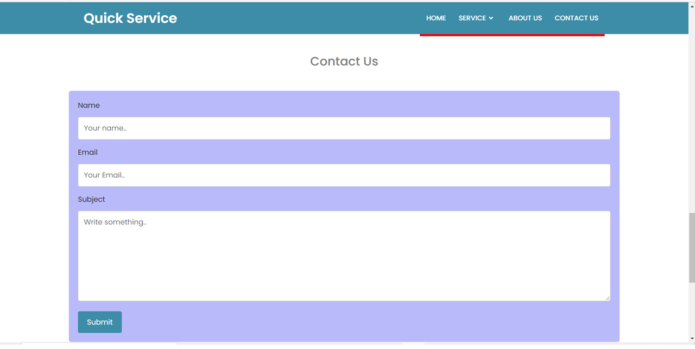
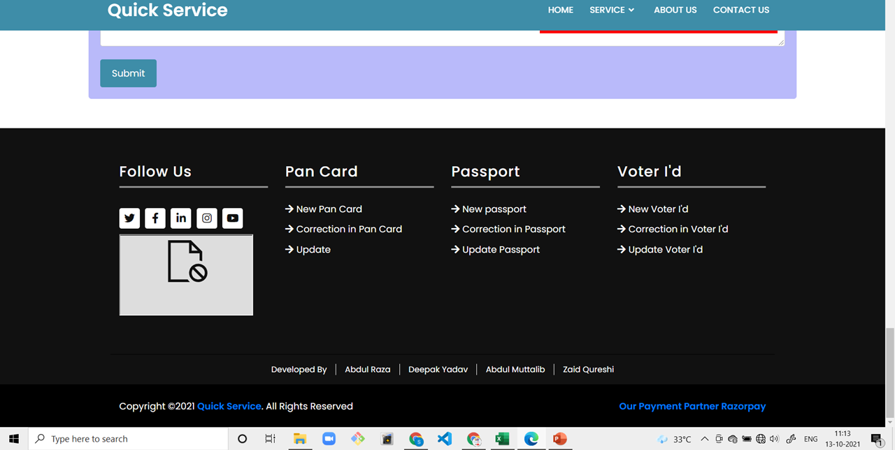

**Working With Fronted Part Using HTML & CSS**               
## First Page of Our Website :

     
## Second Page of Our Website :

## Third Page of Our Website :

## Fourth Page of Our Website :

## Fifth Page of Our Website :

